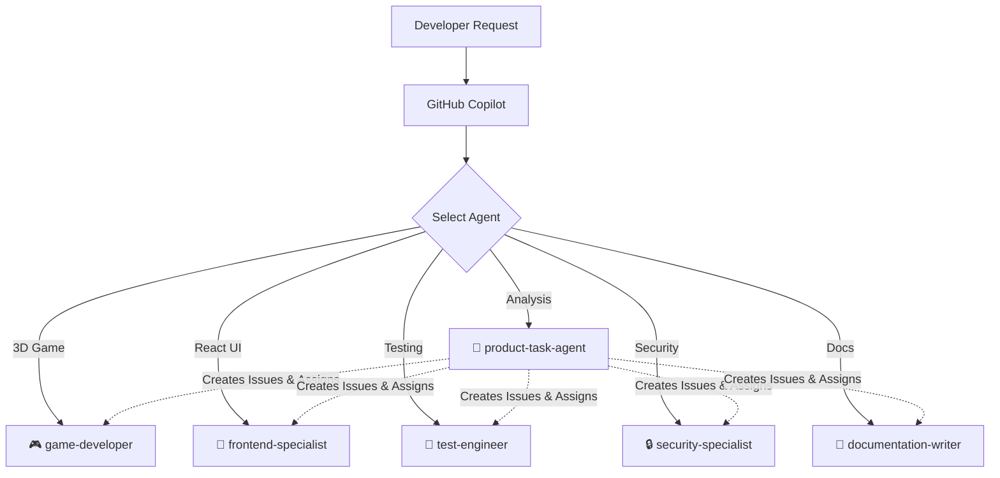

# GitHub Copilot Custom Agents

Custom agent configurations for GitHub Copilot coding agent, specialized for this game template.

## Available Agents

| Agent | Expertise | Tools |
|-------|-----------|-------|
| 🎮 **[game-developer](game-developer.md)** | Three.js + @react-three/fiber, game loops, 60fps performance | view, edit, create, bash, custom-agent |
| 🎨 **[frontend-specialist](frontend-specialist.md)** | React 19, strict TypeScript, component architecture | view, edit, create, bash, custom-agent |
| 🧪 **[test-engineer](test-engineer.md)** | Vitest, Cypress, React Testing Library, 80%+ coverage | view, edit, create, bash, search_code, custom-agent |
| 🔒 **[security-specialist](security-specialist.md)** | OSSF Scorecard, SLSA, OWASP, ISMS compliance | view, edit, bash, search_code, custom-agent |
| 📝 **[documentation-writer](documentation-writer.md)** | JSDoc, READMEs, Mermaid diagrams, ISMS docs | view, edit, create, search_code, custom-agent |
| 🎯 **[product-task-agent](product-task-agent.md)** | Product analysis, issue creation, agent coordination | view, edit, create, bash, search_code, custom-agent |

## Agent-Skill Integration

| Agent | Primary Skills | Secondary Skills |
|-------|---------------|------------------|
| 🎮 game-developer | react-threejs-game, performance-optimization | testing-strategy |
| 🎨 frontend-specialist | performance-optimization | testing-strategy, documentation-standards |
| 🧪 test-engineer | testing-strategy | react-threejs-game, performance-optimization |
| 🔒 security-specialist | security-by-design, isms-compliance | testing-strategy |
| 📝 documentation-writer | documentation-standards | isms-compliance |
| 🎯 product-task-agent | All 6 skills | — |

## Workflow



## Usage

```
@workspace Use the game-developer agent to add a new particle effect
@workspace Ask the test-engineer to improve test coverage for GameScene
@workspace Have the security-specialist review dependencies
```

## Resources

- [Agent Skills](../skills/README.md) — reusable patterns
- [Copilot Instructions](../copilot-instructions.md) — project-wide standards
- [About Custom Agents](https://docs.github.com/en/copilot/concepts/agents/coding-agent/about-custom-agents)
