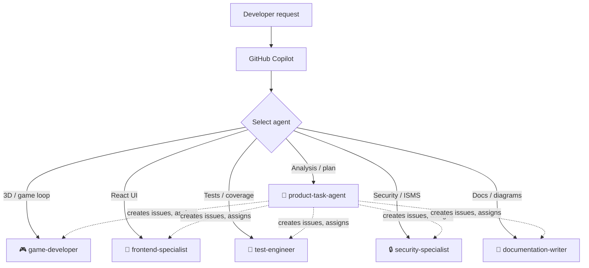

# GitHub Copilot Custom Agents

Repository-level Copilot agents for Hack23 / `game`. Each agent is a YAML-front-matter Markdown file in this directory.

> **Note:** Repository agents **do not** declare `mcp-servers` in their YAML — MCP wiring lives in [`../copilot-mcp.json`](../copilot-mcp.json) and is shared by every agent. All agents here declare `tools: ["*"]` so they have full access to the tools Copilot exposes; governance is provided by the ISMS AI-Augmented Development Controls (see the [`ai-augmented-sdlc`](../skills/ai-augmented-sdlc/SKILL.md) skill).

## Available Agents

| Agent | Expertise |
|---|---|
| 🎮 [game-developer](game-developer.md) | Three.js + @react-three/fiber, game loops, 60 fps, accessibility |
| 🎨 [frontend-specialist](frontend-specialist.md) | React 19, strict TypeScript, WCAG 2.2 AA, bundle optimization |
| 🧪 [test-engineer](test-engineer.md) | Vitest + Cypress + RTL, ≥ 80 % coverage, ≥ 95 % on security code |
| 🔒 [security-specialist](security-specialist.md) | OSSF Scorecard, SLSA L3, OWASP, STRIDE, ISMS compliance |
| 📝 [documentation-writer](documentation-writer.md) | JSDoc, Mermaid, READMEs, ADRs, C4 models, ISMS citations |
| 🎯 [product-task-agent](product-task-agent.md) | Cross-cutting analysis, issue engineering, Copilot coding-agent orchestration |

## Agent × Skill Map

| Agent | Primary skills | Secondary skills |
|---|---|---|
| 🎮 game-developer | `react-threejs-game`, `performance-optimization` | `testing-strategy`, `security-by-design` |
| 🎨 frontend-specialist | `performance-optimization`, `testing-strategy` | `documentation-standards`, `security-by-design` |
| 🧪 test-engineer | `testing-strategy` | `react-threejs-game`, `security-by-design` |
| 🔒 security-specialist | `security-by-design`, `isms-compliance` | `testing-strategy`, `ai-augmented-sdlc` |
| 📝 documentation-writer | `documentation-standards`, `isms-compliance` | `ai-augmented-sdlc` |
| 🎯 product-task-agent | **all 7** | — |

## ISMS Policy Map

| Agent | Primary ISMS policies |
|---|---|
| 🎮 game-developer | [SDP](https://github.com/Hack23/ISMS-PUBLIC/blob/main/Secure_Development_Policy.md), [OSP](https://github.com/Hack23/ISMS-PUBLIC/blob/main/Open_Source_Policy.md) |
| 🎨 frontend-specialist | [SDP](https://github.com/Hack23/ISMS-PUBLIC/blob/main/Secure_Development_Policy.md), [Privacy](https://github.com/Hack23/ISMS-PUBLIC/blob/main/Privacy_Policy.md) |
| 🧪 test-engineer | [SDP §Testing](https://github.com/Hack23/ISMS-PUBLIC/blob/main/Secure_Development_Policy.md) |
| 🔒 security-specialist | [ISP](https://github.com/Hack23/ISMS-PUBLIC/blob/main/Information_Security_Policy.md), [SDP](https://github.com/Hack23/ISMS-PUBLIC/blob/main/Secure_Development_Policy.md), [OSP](https://github.com/Hack23/ISMS-PUBLIC/blob/main/Open_Source_Policy.md), [Threat Modeling](https://github.com/Hack23/ISMS-PUBLIC/blob/main/Threat_Modeling.md), [Cryptography](https://github.com/Hack23/ISMS-PUBLIC/blob/main/Cryptography_Policy.md) |
| 📝 documentation-writer | [ISP §Transparency](https://github.com/Hack23/ISMS-PUBLIC/blob/main/Information_Security_Policy.md), [SDP §Architecture Documentation](https://github.com/Hack23/ISMS-PUBLIC/blob/main/Secure_Development_Policy.md) |
| 🎯 product-task-agent | All policies (cross-cutting) |

## Workflow



## Usage

```text
@workspace Use the game-developer agent to add a new particle effect
@workspace Ask the test-engineer to raise coverage on useGameState
@workspace Have the security-specialist review the dependency additions
@workspace Let product-task-agent plan the next quality-improvement sprint
```

## Governance

- Every agent change is a **Normal Change** under [Change Management](https://github.com/Hack23/ISMS-PUBLIC/blob/main/Change_Management.md)
- All agents use `tools: ["*"]`; least-privilege is enforced by the [`ai-augmented-sdlc`](../skills/ai-augmented-sdlc/SKILL.md) skill and human review
- MCP server configuration lives in [`../copilot-mcp.json`](../copilot-mcp.json) and uses `secrets.COPILOT_MCP_GITHUB_PERSONAL_ACCESS_TOKEN`

## Resources

- [Agent Skills](../skills/README.md)
- [Copilot Instructions](../copilot-instructions.md)
- [ISMS Policy Mapping](../../docs/ISMS_POLICY_MAPPING.md)
- [About Custom Agents](https://docs.github.com/en/copilot/concepts/agents/coding-agent/about-custom-agents)
