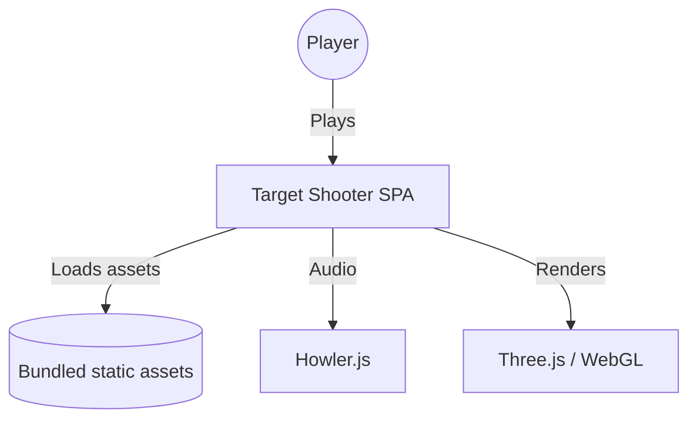

# Documentation Standards Skill

## Context

Applies when writing READMEs, documenting APIs/functions/classes, creating architecture docs, adding JSDoc, drawing diagrams, writing ADRs, documenting security policies, or writing user guides.

Aligned with the architecture-documentation expectations in
[Secure Development Policy §Architecture Documentation Matrix](https://github.com/Hack23/ISMS-PUBLIC/blob/main/Secure_Development_Policy.md).

## Rules

1. **ISMS References** — security-relevant docs cite the applicable Hack23 policy
2. **JSDoc for Public APIs** — every export gets `@param`, `@returns`, `@example` (and `@throws` where relevant)
3. **Include TypeScript types** in JSDoc context (types live in code; JSDoc describes behavior)
4. **Working examples** — every snippet compiles and matches current behavior
5. **Document exceptions** — `@throws` for every thrown error type
6. **Mermaid diagrams** — never screenshots; always include source
7. **Keep READMEs current** — updates ship in the same PR as code changes
8. **Link authoritative external docs** — React, Three.js, vitest, ISO/NIST/CIS
9. **Show anti-patterns** — `❌` examples beside `✅` for high-impact APIs
10. **Accessible markdown** — semantic headings, descriptive links, alt text for images
11. **Heading hierarchy** — H1 → H2 → H3, never skip levels
12. **Specify code-block languages** (` ```typescript`, ` ```bash`, ` ```mermaid`)
13. **ADRs for lasting decisions** — numbered, dated, status tracked (Proposed / Accepted / Deprecated / Superseded)
14. **No PII in examples** — synthetic data only

## Documentation Portfolio (Hack23 standard)

| File | When | Purpose |
|---|---|---|
| `README.md` | Always | Overview, badges, quick start, classification |
| `SECURITY.md` | Always | Vulnerability reporting |
| `SECURITY_HEADERS.md` | Web | Runtime headers |
| `docs/ISMS_POLICY_MAPPING.md` | Always | Feature → policy |
| `docs/ARCHITECTURE.md` | Non-trivial | C4 Context / Container / Component |
| `docs/DATA_MODEL.md` | Stateful | Data structures |
| `docs/FLOWCHART.md` | Processes | Business flows |
| `docs/STATEDIAGRAM.md` | Stateful features | State transitions |
| `docs/FUTURE_*.md` | Roadmap | Future-state counterparts |

## Examples

### ✅ JSDoc for a game function

```typescript
/**
 * Calculates the active target count for a given game level.
 *
 * ISMS: Secure Development Policy §Phase 2 — Secure Coding
 *
 * @param level - Current game level (≥ 1)
 * @returns Number of active targets (1–3) for the level
 * @throws {RangeError} When `level` is not a finite integer ≥ 1
 *
 * @example
 * ```typescript
 * getTargetCountForLevel(1); // 1
 * getTargetCountForLevel(5); // 2
 * getTargetCountForLevel(8); // 3
 * ```
 */
export function getTargetCountForLevel(level: number): number {
  if (!Number.isFinite(level) || level < 1) {
    throw new RangeError('level must be a finite integer ≥ 1');
  }
  if (level <= 3) return 1;
  if (level <= 6) return 2;
  return 3;
}
```

### ✅ C4 Context diagram (Mermaid)

````markdown

````

### ✅ ADR skeleton

```markdown
# ADR 0001 — Adopt Vitest for Unit Testing
- **Status:** Accepted (2025-11-10)
- **Context:** Need fast, ESM-native test runner compatible with Vite.
- **Decision:** Use Vitest with jsdom.
- **Consequences:** Faster feedback; minor migration from Jest APIs.
- **ISMS:** Secure Development Policy §Phase 3 — Security Testing
```

### ❌ Anti-Patterns

```typescript
// BAD: exported function with no JSDoc
export function calc(x: number) { return x * 2; }

// BAD: @example that contradicts behavior
/** @example calc("2"); // 4 */
export function calc(v: number): number { return v * 2; }

// BAD: screenshot-only diagram
// (not maintainable, not accessible, not diffable)
```

## Validation Checklist

- [ ] Every public export has JSDoc with a working `@example`
- [ ] Diagrams are Mermaid source (not images)
- [ ] All internal + external links resolve
- [ ] Heading hierarchy is correct (no skipped levels)
- [ ] Code blocks specify a language
- [ ] Security docs cite the applicable ISMS policy
- [ ] Anti-patterns shown for non-trivial APIs
- [ ] No PII or real-user data in examples
